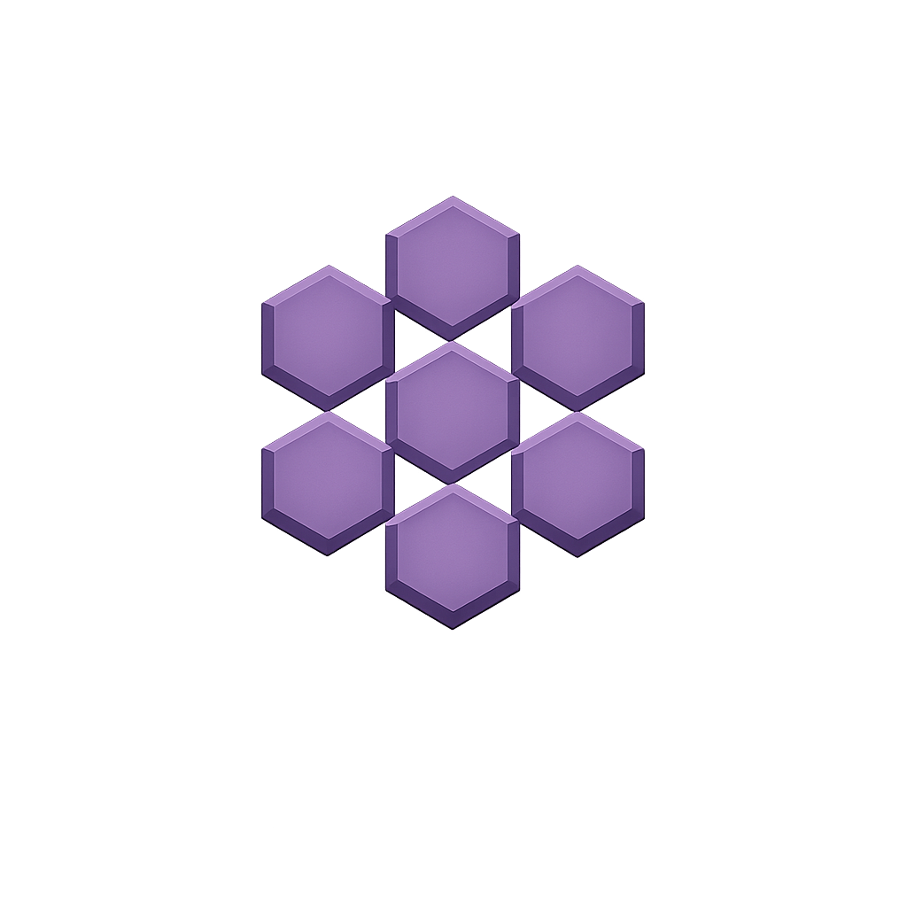

# OpenClay

<p align="center">
  
</p>

<p align="center">
  <strong>Secure First → Execute Second.</strong><br/>
  The universal, zero-trust execution framework for LLM agents.
</p>

---

## What is OpenClay?

OpenClay is a **secure-by-default execution framework** for building LLM-powered agents. Instead of bolting security onto existing frameworks, OpenClay wraps every step — inputs, outputs, tool calls, memory access — inside multi-layered shields *before* any execution happens.

```bash
pip install openclay
```

---

## The Framework at a Glance

| Module | What it does |
|---|---|
| **Shields** | 8-layer threat detection (patterns, ML, DeBERTa, PII, canaries) |
| **Runtime** | Secure execution wrapper — shields fire before and after every call |
| **Tools** | `@ClayTool` — scans tool outputs before they reach the agent |
| **Knight** | Single-task secure agent |
| **Squad** | Multi-agent orchestrator with inter-agent poisoning prevention |
| **Golem** | Autonomous long-running entity with lifecycle management |
| **Memory** | Pre-write and pre-read poisoning prevention for RAG |
| **Policies** | Configurable security posture (Strict, Moderate, Audit, Custom) |
| **Tracing** | JSON telemetry with trace IDs, timestamps, and `TraceLog` |

---

## Quick Example

```python
from openclay import Knight, Shield, ClayMemory

knight = Knight(
    name="researcher",
    llm_caller=my_llm,
    shield=Shield.strict(),
    memory=ClayMemory(),
)

result = knight.run("Find data on AI security")

if result.blocked:
    print(result.trace.explain())
else:
    print(result.output)
```

---

## Next Steps

<div class="grid cards" markdown>

-   :material-download:{ .lg .middle } **Installation**

    ---

    Install OpenClay and optional extras

    [:octicons-arrow-right-24: Getting Started](getting-started/installation.md)

-   :material-rocket-launch:{ .lg .middle } **Quick Start**

    ---

    Build your first secure agent in 5 minutes

    [:octicons-arrow-right-24: Quick Start](getting-started/quickstart.md)

-   :material-shield:{ .lg .middle } **Shields**

    ---

    Deep dive into the 8-layer threat detection engine

    [:octicons-arrow-right-24: Shields](core/shields.md)

-   :material-api:{ .lg .middle } **API Reference**

    ---

    Complete reference for all exports

    [:octicons-arrow-right-24: API Reference](api/reference.md)

</div>

---

<p align="center">
  Built by <a href="https://neuralchemy.in">Neural Alchemy</a>
</p>
